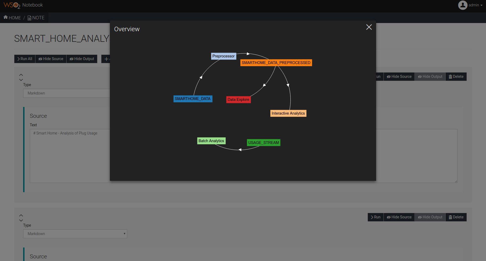

# Notebook
---
This project contains a web app designed to be run in the [WSO2 Data Analytics Server](http://wso2.com/products/data-analytics-server/). Notebook provides a unified analytics tool that is capable of performing the following functions.

* Preprocessing Data
* Batch Analytics (Using spark queries)
* Interactive Analytics (Using Lucene queries, Primary keys, Timestamp ranges)
* Data Exploring (Scatter Plots, Trellis Charts, Parallel Sets, Cluster Diagrams)

### How to run

1. Download WSO2 Data Analytics Server ([Download binaries](http://wso2.com/products/data-analytics-server/) or [build from source](https://github.com/wso2/product-das)).
2. Download Notebook repository as a zip file and extract or clone the repository.
3. Go to the root directory of the Notebook and run `mvn clean install` to build the project
4. Copy \<NOTEBOOK_HOME>/components/org.wso2.carbon.notebook.commons/target/notebook-commons-\<VERSION>.jar & \<NOTEBOOK_HOME>/components/org.wso2.carbon.notebook.core/target/notebook-core-\<VERSION>.jar to \<WSO2_DAS_HOME>/repository/components/lib/ directory.
5. Copy \<NOTEBOOK_HOME>/components/org.wso2.carbon.notebook.api/target/notebook.war to \<NOTEBOOK_HOME>/repository/deployment/server/webapps/ directory.
6. Run the WSO2 Data Analytics Server
7. Go to https://\<SERVER_URI>:\<PORT>/notebook/index.html (Default port : 9443)
8. Use your credentials for the WSO2 Data Analytics Server to login (Use "admin" as both username and password if you are using the WSO2 DAS for the first time)

### How to use

1. Go to https://\<SERVER_URI>:\<PORT>/notebook/index.html. You will be redirected to the sign in page. Log in using your credentials for the WSO2 Data Analytics Server.
2. After signing in, select an existing note from the list of notes
   
   
   
   Or create a new note
   
   
3. After that you can start adding paragraphs and start analysing from the page that opens up.

### Paragraphs

There are five types of paragraphs that are currently included in the notebook. You can add paragraphs to the note to perform analysis and group together relevant paragraphs in separate notes.

In each one of them there is a paragraph type combo box. After selecting the paragraph type the source view for the paragraph will be loaded according to the paragraph type specified. After entering the relevant details you can click \<Run> to run the paragraph. The notebook will show the results in the output view which will be loaded after clicking run.

1. Preprocessor Paragraph

   

2. Batch Analytics Paragraph
   
   

3. Interactive Analytics Paragraph
   
   

4. Data Explore Paragraph
   
   

5. Markdown Paragraph
   
   
   
You can get a directed graph showing how the paragraphs and tables are connected by clicking the \<Show Overview> button. You can drag the nodes around in the graph to get the clear view of the graph.

